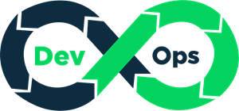
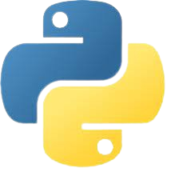
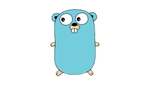

<!-- PROJECT TITLE -->
  <h1 align="center">DevOps projects</h1>
 

  

<h1 align="center">
 About
</h1>

 This repository contains projects/exercises built to acquire practical DevOps skills

## AWS

 

 

## Python

 

 

## Bash scripting

 

 

## Golang

 

 
